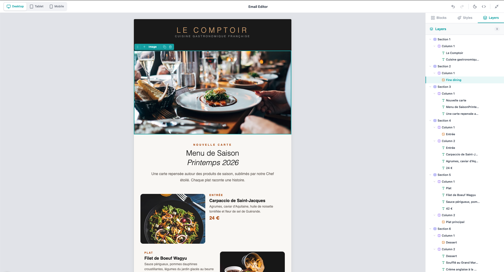
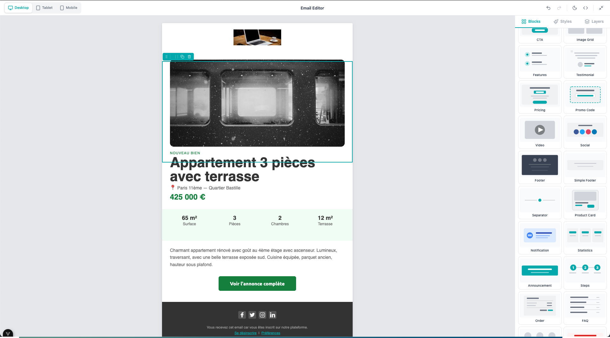

# Email Editor And AI

<p align="center">
  <a href="https://www.npmjs.com/package/@fpfe-group/email-editor-ai"></a>
  <a href="https://github.com/fpfe-group/email-editor-ai.git"></a>
  <a href="https://github.com/fpfe-group/email-editor-ai.git"></a>
  
  
  
</p>

<p align="center">
  一个基于 <strong>Vue 3</strong> 和 <strong>MJML</strong> 构建的专业级<strong>拖拽式</strong>邮件编辑器。<br/>
  可视化设计响应式 HTML 邮件，内置 43 个区块、AI 生成、Merge Tags、插件、i18n 等能力。
</p>
|                    拖拽式编辑器                     |                          预置模板                          |
| :-------------------------------------------------: | :--------------------------------------------------------: |
|  |  |

## 文档

完整 API 参考、插件指南、AI 集成示例等内容请查看：

**[文档 →](https://fpfe-group.github.io/email-editor-ai/)**

## 安装

```bash
npm install @fpfe-group/email-editor-ai vue@^3.4 mjml-browser@^4.15
```

## 快速开始

```vue
<script setup lang="ts">
import { ref } from "vue";
import { EmailEditor } from "@fpfe-group/email-editor-ai";
import "@fpfe-group/email-editor-ai/style.css";

const mjml = ref("");
const html = ref("");
const designJson = ref();
</script>

<template>
  <EmailEditor
    ref="editorRef"
    v-model="mjml"
    :design-json="designJson"
    @update:compiled-html="html = $event"
    @update:design-json="designJson = $event"
  />
</template>
```

这样就可以渲染一个完整的拖拽式邮件编辑器，支持实时预览、撤销/重做和 HTML 导出。

## 亮点

- **43 个区块**：包含布局、内容和 30 个现成组合区块（Hero、Pricing、Testimonial、FAQ 等）。
- **行内编辑**：双击文本即可通过 TipTap 编辑，支持加粗、斜体、链接和颜色。
- **AI 生成**：用自然语言描述邮件，即可生成可用于生产的模板（BYOAI）。
- **Merge Tags**：插入 `{{first_name}}` 这类动态变量，并以可视化标签展示。
- **条件内容**：基于 Merge Tag 值控制区块显示/隐藏。
- **22 个入门模板**：欢迎邮件、Newsletter、电商、弃购挽回等场景开箱即用。
- **ESP 导出**：为 Mailchimp、SendGrid、Brevo、AWS SES、Postmark、Resend 预格式化 HTML。
- **深色模式预览**：在画布中模拟邮件客户端的深色模式渲染效果。
- **插件系统**：可添加自定义区块、工具栏动作和侧边栏面板。
- **i18n**：默认中文文案，并内置法语翻译，提供 175+ 个可翻译 label key。
- **主题定制**：通过 `theme` prop 自定义颜色、字体和圆角。
- **撤销/重做**：完整历史记录，支持 `Ctrl+Z` / `Ctrl+Shift+Z`。
- **命令式 API**：通过 ref 调用 `getMjml()`、`getHtml()`、`selectNode()`、`deleteNode()` 等方法。

## AI 模板生成

可以接入任意 LLM，例如 OpenAI、Anthropic、Gemini，或你自己的后端服务：

```vue
<EmailEditor
  v-model="mjml"
  :ai-provider="{
    generateText: async (prompt, ctx) => {
      /* your API call */
    },
    generateTemplate: async (messages, systemPrompt) => {
      /* your API call */
    },
  }"
/>
```

编辑器会自动处理 JSON 解析、修复和重试。

## 主题与 i18n

```vue
<EmailEditor
  :theme="{ primaryColor: '#7C3AED', borderRadius: '8px' }"
  :labels="FR_LABELS"
/>
```

## 许可证

[MIT](LICENSE)
